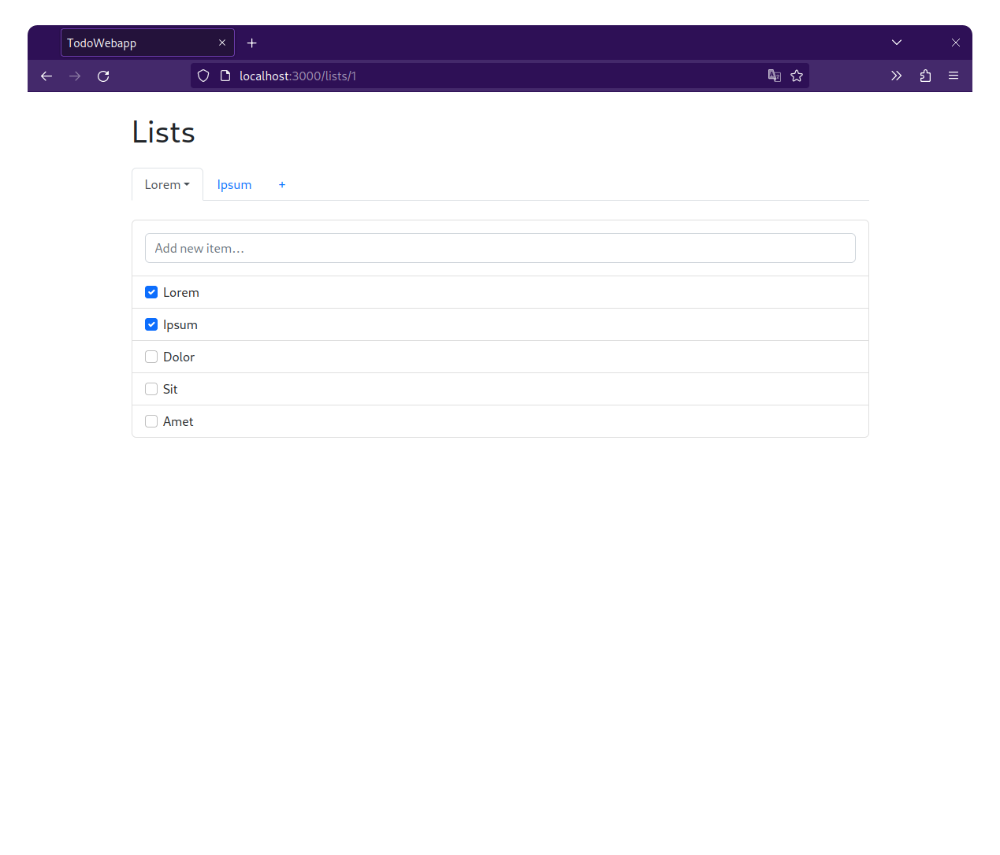
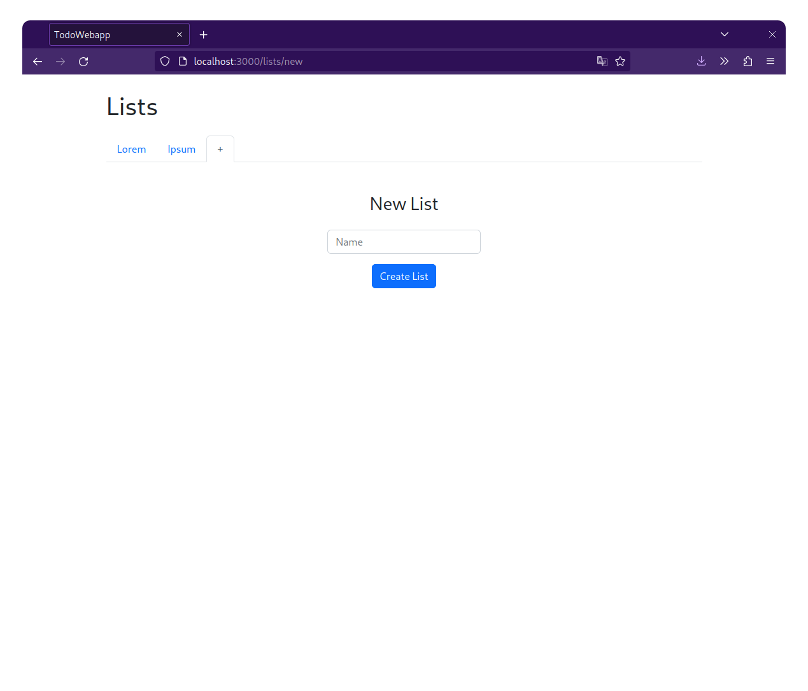
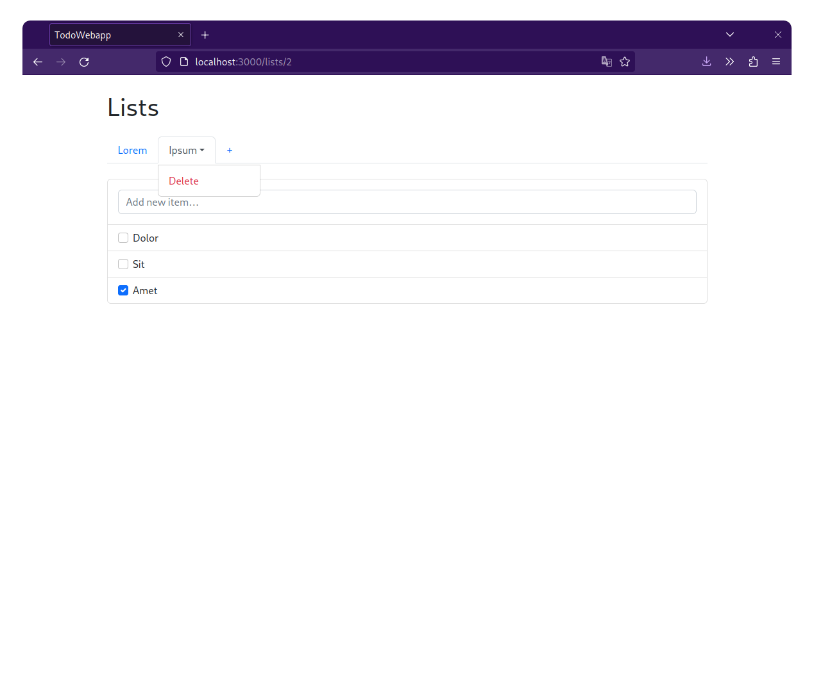
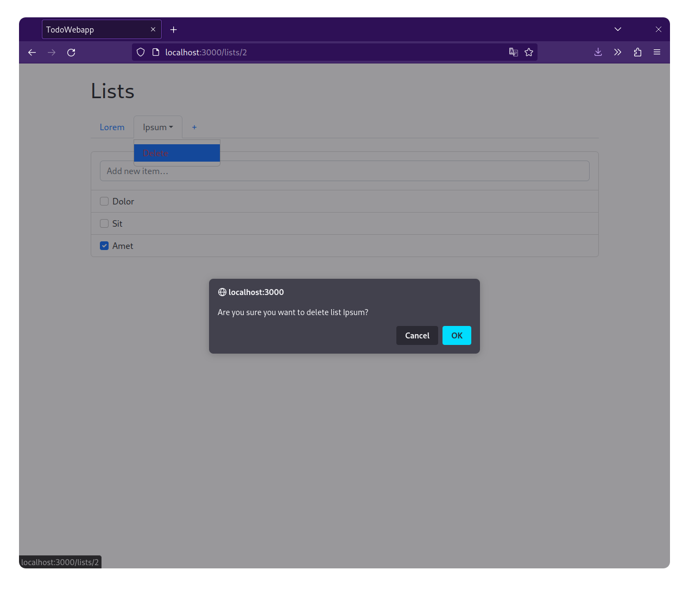
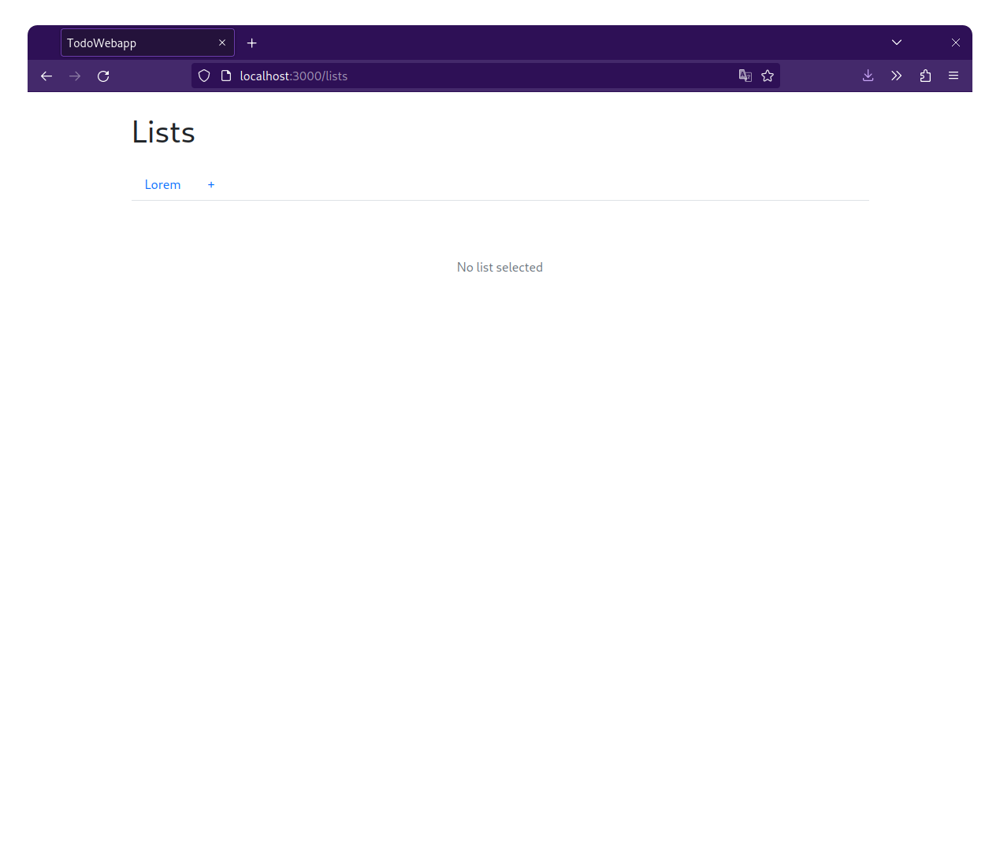

# Todo web app

Simple Todo web app made in Ruby on Rails 7

## Screenshots
<table>
    <tr>
        <td colspan="4"></td>
    </tr>
    <tr>
        <td></td>
        <td></td>
        <td></td>
        <td></td>
    </tr>
</table>

## How to run it
0. Install Ruby, Node.js and clone this repo
1. Install dependencies
```shell
bin/bundle install
npm install
```
2. Run database migrations
```shell
bin/rails db:migrate
```
3. Build CSS and JS
```shell
npm run build
npm run build:css
```
4. Start the server
```shell
bin/rails server
```
